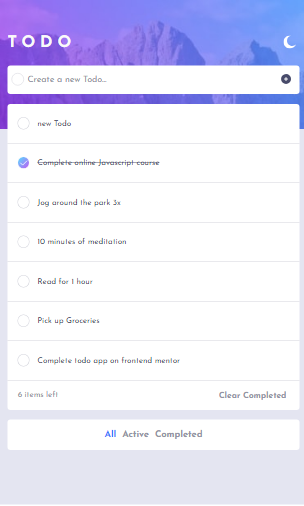
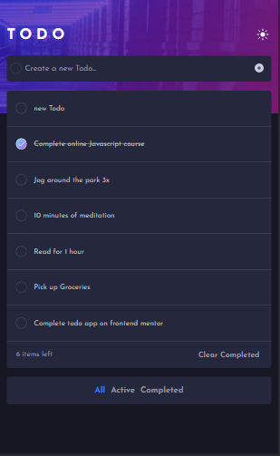
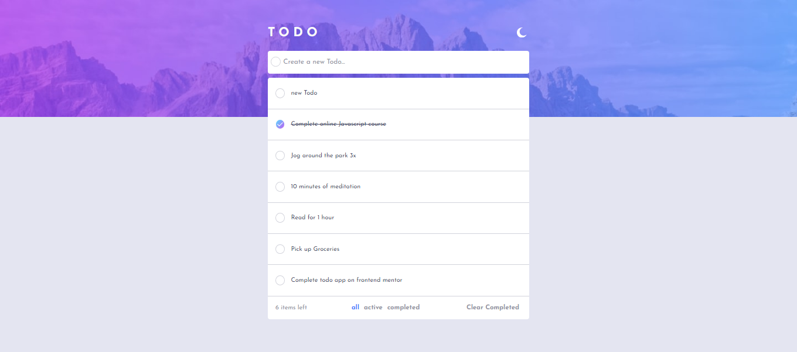
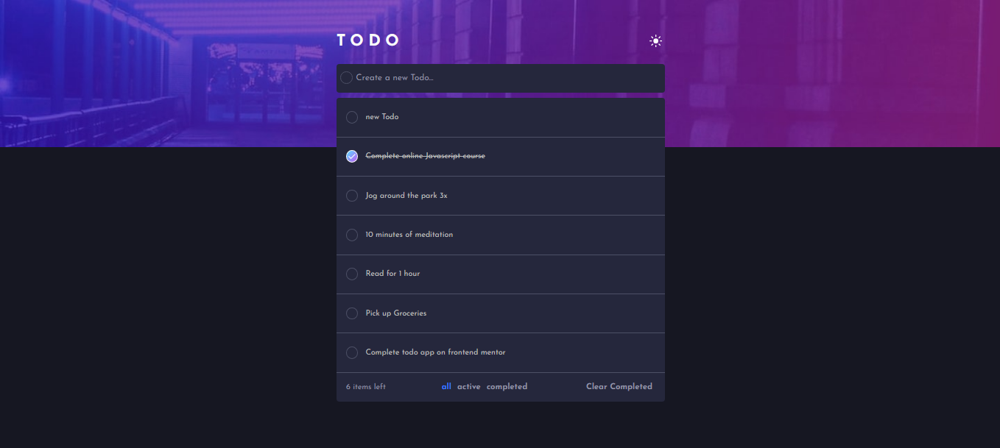

# React + Vite
[Frontend Mentor](https://www.frontendmentor.io)

this app can do the following topics: 
  - ✅ View the optimal layout for the app depending on their device's screen size
  - ✅ See hover states for all interactive elements on the page
  - ✅ Add new todos to the list
  - ✅ Mark todos as complete
  - ✅ Delete todos from the list
  - ✅ Filter by all/active/complete todos
  - ✅ Clear all completed todos
  - ✅ Toggle light and dark mode

## Overview

### Screenshots
 ### Mobile Version

### Desktop Version
  
  

## My process 
its done with:
- ⚛️ [React](https://reactjs.org/) - JS library
- 💅 [Styled Componets](https://styled-components.com/) - CSS in JS Library
- 🐻 [Zustand](https://zustand.docs.pmnd.rs/getting-started/introduction) - Global State Management 

## Author
  _Created by OskrAlvarez | Challege Frontend Mentor_